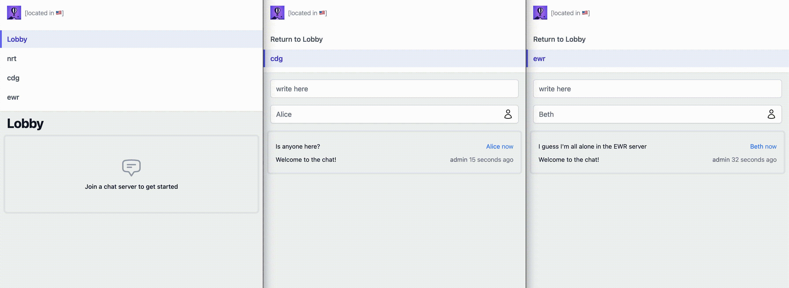
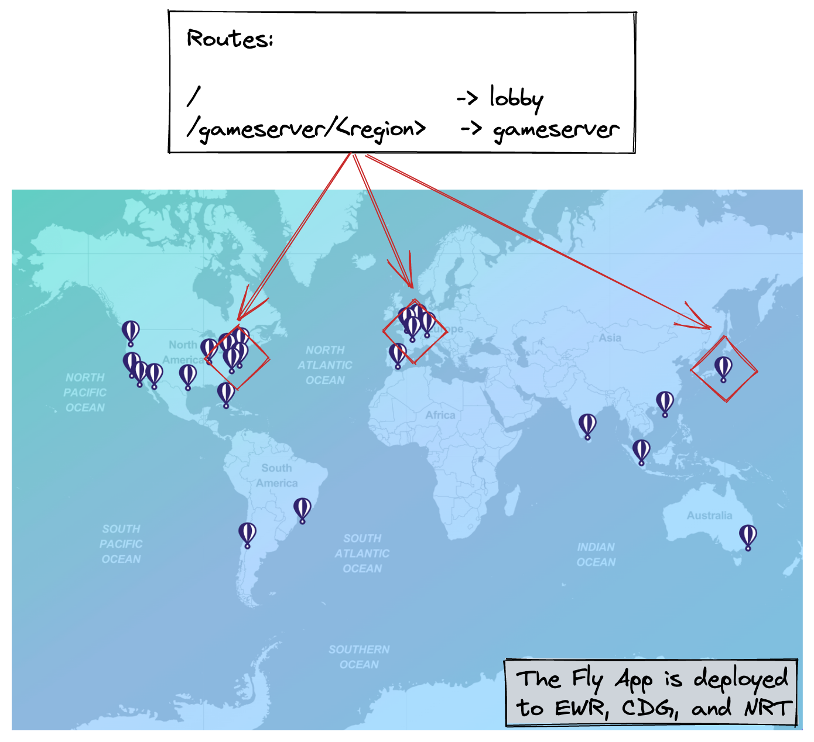
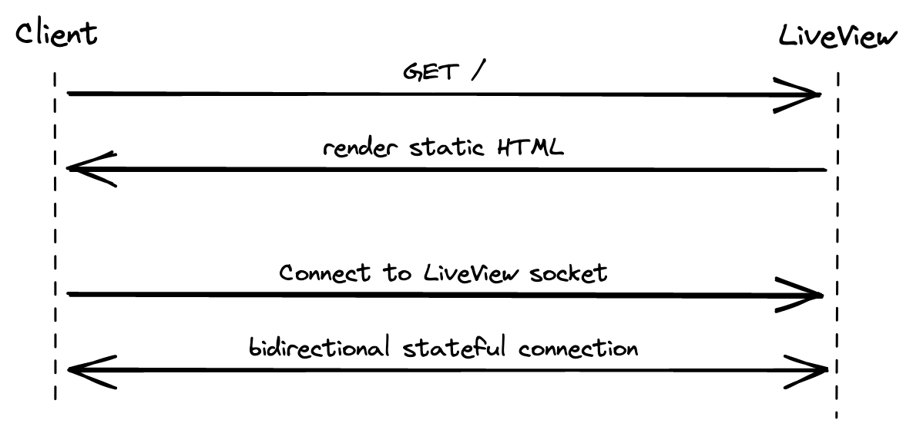
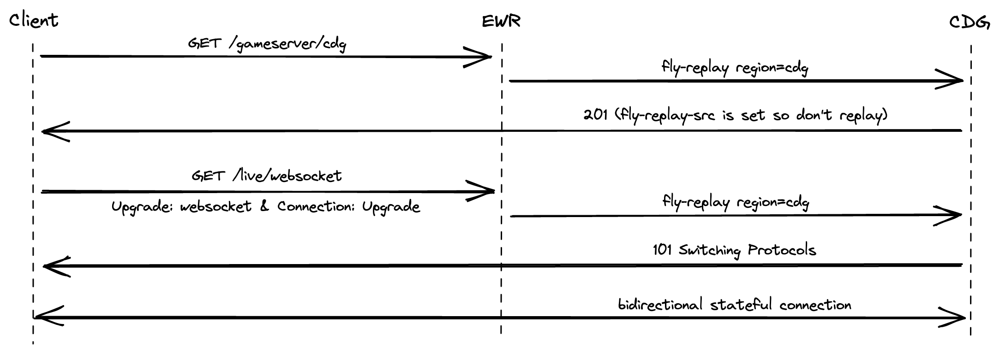
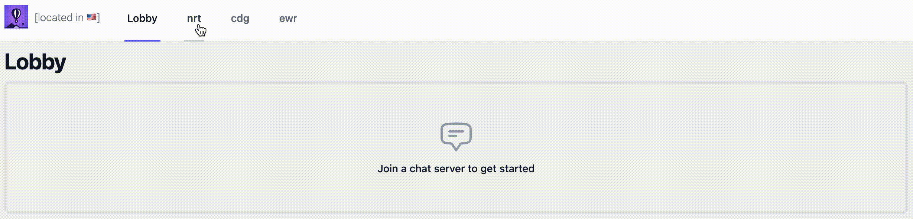

# fly-proxy-demo
A demo of a globally distributed platform of low-latency, high-volume gameservers built on Fly.io and its built-in proxy

[demo](https://fly-replay-header-demo.fly.dev/) | [phoenix repo](https://github.com/mtremsal/fly-machines-proxy-demo) | [caddy repo](https://github.com/mtremsal/fly-replay-header-caddy)

## A common problem

There's a class of use cases that share similar requirements despite looking quite different at first glance:

* A chat room linearizes and displays concurrent messages between tens of thousands of users.
* A gameserver computes an authoritative state from the inputs of players and the internal logic of its world.
* A collaborative graphics editor syncs high-frequency changes to the positions, colors, etc. of its shapes.

In all cases:

1. **Low-latency** is essential to a compelling user experience, implying a deployment across tens of regions globally. 
2. **Performant and scalable** compute is needed to process a high volume of concurrent inputs.
3. The service requires **strong consistency** to resolve inputs into a single source of truth before displaying it back to users.

Historically, these requirements have often resulted in difficult tradeoffs: _global, performant, strongly consistent -- pick 2_.

A potential approach could be to build such a service on top of a CDN's edge offerings. Maybe something like [Cloudflare Workers](https://developers.cloudflare.com/workers/) for globally distributed compute, connections over [WebSockets](https://developers.cloudflare.com/workers/runtime-apis/websockets/) for real-time low-latency communications, and updating [Durable Objects](https://developers.cloudflare.com/workers/learning/using-durable-objects) to sync state across parallel executions. In fact, the [release announcement](https://blog.cloudflare.com/introducing-workers-durable-objects/) for durable objects specifically mentions similar use cases as their intended target.

Still, for an average engineer such as yours truly, this isn't exactly a walk in the park. We have to learn the specific APIs and idiosyncrasies of a given vendor. We can't easily test our code locally because a lot of the complexity comes from the interplay of various serverless offerings. We're strongly nudged towards the javascript / typescript / Wasm ecosystem rather than our runtime or framework of choice.

On paper, [Fly.io](https://fly.io/) provides an interesting alternative:

* [Firecracker microVMs](https://fly.io/blog/sandboxing-and-workload-isolation/) provide great workload isolation, quick boot times, and performant compute.
* [Fly Machines](https://fly.io/docs/reference/machines/) offer an API to manually orchestrate VMs and the ability to scale down to zero.
* The [WireGuard-backed Anycast network](https://fly.io/blog/ipv6-wireguard-peering/) connect all instances across regions on a mesh VLAN.
* The [Fly-Replay Header](https://fly.io/docs/reference/fly-replay/) dynamically configures Fly's built-in proxy to route network requests.

This all seems a bit too good to be true, so **this project explores how well these claims hold in practice, and where sharp edges remain**.

## Fly-powered demo

**Try the full demo at:** [fly-replay-header-demo.fly.dev](https://fly-replay-header-demo.fly.dev/)

**Try the demo app without network routing at:** [fly-machines-proxy-demo.fly.dev](https://fly-machines-proxy-demo.fly.dev/)

### Building a demo app



Our solution has two parts: 

* A `lobby` that lists available gameservers in various regions and lets users join them. 
* A `gameserver` that accepts connections from many concurrent users. Each `gameserver` is in its own region, and only users connected to the same `gameserver` can chat/play/work together.

The `gameserver` serializes and synchronizes everyone's inputs and displays the resulting authoritative state back to users in real-time. We share the same codebase for the `lobby` and `webserver` and deploy it as a regular Fly App to any number of regions. Here, we've deployed to EWR 🇺🇸, NRT 🇯🇵, and CDG 🇫🇷. 



We could route traffic to individual instances, but to keep the demo simple, we're deploying 1 instance per region, and are routing traffic per region. If we wanted to route traffic to individual instances, we'd need the instance ids to be static, which would also require deploying them as Fly Machines rather than as a managed App.

We run the [`Phoenix`](https://github.com/phoenixframework/phoenix) web server because LiveViews (real-time server-rendered pages) let us minimize the amount of code we write for the frontend and PubSub mechanism, to focus on the interesting bits. The `lobby` is a LiveView that lives at `/`. The `gameserver` is a LiveView running at `/gameserver/<region>`. An individual instance doesn't keep track of which other instances are running, only that the app is deployed in 3 specific regions. 

The little flag shown in the navigation bar visually confirms where a request is served from based on the `FLY_REGION` env variable that each instance has access to. For now, we're serving all requests from the instance closest to the user, courtesy of Fly's Anycast network.



When a user loads a LiveView, in practice it first GETs a static version of the HTML, then it establishes a websocket to open a stateful bidirectional connection that allows fast server-side rendering and dynamic updates. Rather than relying on traditional forms, we tap the websocket to post new messages, change the username, and refresh all messages in real time. We even piggyback on the websocket to subscribe to a shared PubSub topic called `gameserver:<region>`; each user broadcasts their own messages to the topic and receives everyone's messages in return. Phoenix and LiveView buy us quite a bit here: no SPA, no kafka, no refresh mechanism, etc.

Now time, to try and get `gameserver/cdg` to actually serve from the instance in the CDG region, and so on.

### Routing requests - the goal

There are a couple moving pieces to understand how one might go about "dynamically redirecting websockets".

The default behavior of Fly Apps is to route requests to the instance closest to the user. This is done by automatically assigning a single public-facing IPv4 address for the entire app and, when requests come in, utilizing BGP Anycast to proxy the request where it has the least travel to do. It's pretty magical, and we definitely want to retain this behavior for serving the lobby (i.e. the `/` route).

Each instance also runs a [proxy](https://fly.io/docs/reference/architecture/#fly-networking) that, among other things, takes care of establishing the wireguard-based mesh connections to everything else that runs in your organization, essentially faking a local LAN despite everything being scattered across a bunch of different regions. This proxy is user-configurable to some extent with the [Fly Replay Header](https://fly.io/docs/reference/fly-replay/). By setting the `fly-replay` response header into HTTP calls we can tell the proxy _"while this was delivered to me, I'd like you to replay it to a different region/instance/app/etc. instead"_. So now, instead of deploying our own proxy or service mesh, and having to keep track of the IPs assigned to all our instances across a bunch of different regions, we can just declaratively say _"route this request over there, as if I had never received it in the first place"_. Pretty cool.

We'll want to avoid creating redirection loops. Let's say we inject `fly-replay region=cdg` in all calls to the `/gameserver/cdg` route. The first request reaches EWR (or whatever's closest) and the proxy agrees to replay it to CDG instead. But now we have a call to `/gameserver/cdg` that needs to actually be served by the instance in CDG, and not replayed. How do we insure we don't inject the response header into this call as well and cause a loop? Luckily for us, Fly's proxy adds a request header called `fly-replay-src` into all requests it replays. We just need to ensure we only inject the `fly-replay` response header into calls that don't already have `fly-replay-src` as a request header. (note: with this approach we're still doing a single pointless redirection if the user happens to initially be routed to the intended region because it's closest -- it's a local redirect taking 2ms so we can live with this.)

Okay, so our neat trick works for regular HTTP calls, but what about websockets? Crucially, establishing a websocket is really just going through a handshake with regular HTTP/1.1 calls. The client [opens the handshake](https://www.rfc-editor.org/rfc/rfc6455#section-1.3) by embedding the request headers `Upgrade: websocket` and `Connection: Upgrade`, and assuming the server agrees, it responds with a `101 Switching Protocols` response code. This looks a lot like the [TLS upgrade scheme](https://www.rfc-editor.org/rfc/rfc2817) (RFC2817). 

So, in theory, we can configure Fly's proxy to dynamically route regular requests as well as websockets to any region. For a LiveView, it would look like this:



Well, let's try to actually implement this, shall we?

### Routing requests - within Phoenix

Phoenix and its ecosystem rely on a library called [`Plug`](https://hexdocs.pm/phoenix/plug.html) to model and modify connections. Plugs form "pipelines" that take successive actions on connections as they flow from the application's overall `Endpoint` to a `Router` and from there to a `Controller` or `LiveView`.

Here's our custom `Plug`:

```elixir
defmodule FlyMachinesDemoWeb.Plugs.FlyReplayHeader do
  alias Plug.Conn

  # The init function helps define compile-time options that define the behavior of the Plug.
  # Here we don't need to do anything, so we just return options
  def init(opts), do: opts

  # We pattern-match requests based on their path.
  # If they're directed at the /gameserver/<region> route, we consider replaying them elsewhere.
  def call(%Conn{path_info: ["gameserver" | path_info_tail]} = conn, _opts) do
    # Get the region from the second part of the path
    # We could do this with pattern-matching but it's not terribly easy to read.
    region = hd(path_info_tail) 
    
    # Is already replayed by proxy? If so, don't replay to avoid loops.
    # Otherwise, insert the "fly-replay" response header.
    if [] != Conn.get_req_header(conn, "fly-replay-src") do
      conn
    else
      Conn.put_resp_header(conn, "fly-replay", "region=#{region}")
    end
  end

  # Let all other requests flow through the Plug unchanged.
  def call(%Conn{} = conn, _opts), do: conn
end
```

Unfortunately, this approach doesn't fully work. Blink and you might miss it: the flag turns to NRT 🇯🇵 briefly then back to EWR 🇺🇸. While the initial static call gets redirected to the NRT region as expected, the LiveView's websocket handshake doesn't. Why is that?



See [this thread](https://elixirforum.com/t/how-to-intercept-http-messages-generated-by-endpoints-socket-macro-with-a-plug/50377) for details. While nearly all steps in our connection plumbing (`Endpoint > Router > Controller`) are made of successive `Plug`s, mounting the websocket is handled slightly differently. The details are in the docs for [`Phoenix.Endpoint`](https://hexdocs.pm/phoenix/Phoenix.Endpoint.html#socket/3) and specifically the `socket` macro. The macro captures the websocket HTTP handshake, and thus doesn't let our custom `Plug` act on it downstream.

The lesson here is to pick a framework that lets you customize calls within the handshake to insert response headers. Node's `socket.io` should be able to handle this for example. But we're getting a lot of free features from Phoenix here, so let's deactivate our custom Plug and try to handle the routing logic outside the app. Let's partner with Caddy. 


### Routing requests - with Caddy as reverse proxy

Caddy is a turnkey web server and reverse proxy written in go. It's quite beloved and full-featured, including for its default behavior of [using HTTPS automatically](https://caddyserver.com/docs/automatic-https#automatic-https). Nginx would definitely do the job, but Caddy's configuration file, the well-named `Caddyfile`, tends to be significantly more readable than its Nginx counterpart.

There are a couple interesting gotchas to deploying a reverse proxy on Fly, documented in this [other repo](https://github.com/mtremsal/fly-replay-header-caddy). But by and large, we're just deploying a regular Fly App from a Dockerfile with a simple config. The interesting bits are how to leverage Caddy's named matcher along with the `Map` and `Header` directives to handle the redirection. 

```Caddyfile
:8080 {
    # Parses the path to assign the variable {target_region} based on the second capture group of the regex
    map {path}                  {target_region} {
        ~(.*)/gameserver/(.*)$  "region=${2}"
        default                 ""
    }

    # Defines a named matcher that checks that the request is for a gameserver and hasn't been already redirected by the proxy
    @tobereplayed {
        path /gameserver/*
        header !fly-replay-src
    }

    # Adds a response header to all requests that should be replayed with the target region
    header @tobereplayed fly-replay {target_region}

    # Proxies everything to the upstream server (i.e. the demo app)
    reverse_proxy * https://fly-machines-proxy-demo.fly.dev:443
}
```

Surely this works, right? Close, but no cigar. 

Caddy's debug logs explain our mistake: we're not redirecting the handshake because it uses a static URI: `/live/websocket`. Unfortunately, simply adding this path to our `@tobereplayed` named matcher won't work, because we don't know _where_ to replay the request. Not only the target region is not in the path, it's not anywhere to be seen in the HTTP request. 

If we hardcode the target instance in the Caddyfile, the full behavior works as expected. Huzzah! But of course, that's a single instance, and not quite our stated goal. Let's go back to Phoenix and figure out how to provide the target region somewhere in the websocket handshake!


### Routing requests - with Caddy as reverse proxy and websocket params in Phoenix

We need to track which region the `/live/websocket` calls are meant to reach. There are several ways to achieve this, such as storing the target region in the session and injecting it into the socket's [params](https://hexdocs.pm/phoenix/Phoenix.Endpoint.html#socket/3-path-params),or adding each region as a subdomain instead of in the path (e.g. `ewr.fly-replay-header-demo.fly.dev/gameserver`). 

In the interest of time, we're going to approach the problem in a jankier way: we'll inject the target region as a param in the query string of the initial HTTP call. Phoenix already does something similar to inject the CSRF token in the `app.js` file. We can expand this approach by passing the path (e.g. `gameserver/cdg`) and the region (e.g. `cdg`) in a similar manner.

```js
let csrfToken = document.querySelector("meta[name='csrf-token']").getAttribute("content")

// Pass the path and region as params to the new LiveSocket
let path = window.location.pathname.toString()
let re = new RegExp("^/gameserver/(.*)$");
let region = ""
if (re.test(path)) {
    region = path.match(re)[1]
}

let liveSocket = new LiveSocket("/live", Socket, {params: {
    _csrf_token: csrfToken, 
    _region: region,
    _path: path,
}})
```

This isn't as clean and efficient as providing the target region as either a subdomain or in the path, but we can still get Caddy to extract it from the URI:

```Caddyfile
:8080 {
    # Parses the path to assign the variable {target_region} based on the second capture group of the regex
    map     {uri}                                           {target_region} {
            ~\/gameserver\/(.+)$                            "region=${1}"
            ~\/live\/websocket\?.*_region=(.+)\&_path.*$    "region=${1}"
            default                                         ""
    }

    # Defines a named matcher that checks that the request is for a gameserver and hasn't been already redirected by the proxy
    @tobereplayed {
        path /gameserver/*
        header !fly-replay-src
    }

    # Defines a named matcher that checks that the request is for a liveview's websocket and hasn't been already redirected by the proxy
    # The regex in the map ensures the region cannot be null
    @tobereplayedws {
        path /live/websocket*
        header !fly-replay-src
    }

    # Add a response header to all requests that should be replayed with the target region
    header @tobereplayed    fly-replay {target_region}
    header @tobereplayedws  fly-replay {target_region}

    # proxy everything else to the fly-machines-proxy-demo.fly.dev upstream server
    reverse_proxy * https://fly-machines-proxy-demo.fly.dev:443
}
```

We're now seeing successful dynamic redirections for the websocket call tied to gameservers (not for the lobby). At long last, we've achieved our goal!

Or have we? The logs indicate that some rebel requests are still getting served by the initial instance, forcing clients to reconnect to the target. We'll definitely have to troubleshoot this later. For now, let's pause to summarize what we've already learned so far.

## Findings and sharp edges

So, what have we learned? First of all, there's tremendous value in running actual VMs at the edge:

1. Getting all users on a single shared VM buys us low-latency and high-volume updates, without having to rely on a quirky serverless storage service.
2. Working with full VMs provides a lot of flexibility in terms of architecture, such as letting us run whatever runtime and library we're familiar with. 
3. Compared to a traditional public cloud provider, we didn't have to punch holes through firewalls and security groups to get isolated regions to talk to each other. 
4. We were able to develop and test our app locally, with quick iterations, without having to push it to several serverless APIs each time.
5. Relying on the Fly-Replay Header could remove the need to run our own proxy or service mesh for global routing.

That being said, we also cut ourselves on some sharp edges:

While point 4 above is valuable for iterating quickly on the app, it doesn't apply to the networking layer, which is unique to Fly.io. Here, redeploying changes is part of the development loop. Thankfully, deploys are really fast because: 

* We usually change a single layer of the container and the others are cached.
* Builds are remote, executed on a beefy machine.
* Micro-VMs boot extremely quickly.

Regarding point 5, we couldn't quite get the Fly Replay Header to work with Phoenix alone. We'll need to take a couple precautions next time: 

* Pick a framework that lets us customize websocket handshake calls, or hand roll raw websockets.
* Pass the relevant routing logic as a param to the websocket, ideally in the subdomain or the path.

While we didn't run into them because we kept the demo to managed Fly Apps, let's also keep in mind the limitations listed in the announcement post for [Fly Machines](https://fly.io/blog/fly-machines/#how-fly-machines-will-frustrate-you-the-emotional-cost-of-simplicity), most notably that stopped machines aren't guaranteed to be available again and aren't fully free.

## What's next?

### Custom domain

We're currently leaning on Fly's default domain name on the `.dev` TLD. Fly makes it really easy to bring your own [custom domain](https://fly.io/docs/app-guides/custom-domains-with-fly/) and generating a certificate for it. We'd need to change one line in Phoenix's config to teach it about the new domain. Easy as pie!

### Higher throughput

The demo currently showcases a simple chat for the real-time collaboration use case. In particular, the chat use case is stateless: while there's a shared PubSub topic for all connected users, each LiveView is in charge of displaying new messages that it receives, and only starts receiving messages after joining. A quick improvement would be to have a stateful server that caches the last n messages received so that new users can catch up on the conversation. A more involved upgrade would be to switch to a real-time graphics editor or a multiplayer mini-game that would synchronize hundreds of updates per second for each user.

### Network isolation

While Machines are private by default, the demo still operates lobbies and gameservers on the same default network shared by the entire Fly organization. This is very convenient, but for a production scenario we'd likely isolate gameservers in their own private network. The guide to [build a Function-as-a-Service platform](https://fly.io/docs/app-guides/functions-with-machines/) touches on this point.

### VM orchestration

The demo doesn't currently demonstrate how Machines scale to zero and boot fast. In fact, we're not using Machines, just regular Apps. Switching to Machines would let us shut down empty gameservers (without any active websocket connection) after a few seconds. The lobby would start a gameserver before the first user joins it. Note that the lobby remains stateless: if we attempt to start an already running gameserver, we can just ignore the error and move on. We could take it even further and build per-instance routing within a region to allow dynamically scaling up when some instances are at capacity.

More importantly, Machines would help us guarantee that we route to a specific instance (based on its instance id) whereas routing per region can lead to some inconsistencies. For example, with 3 target regions and a scale count of 3, it's not technically guaranteed that each region will get a single instance.

## References

**[Fly.io docs and guides]** Reference for [Machines](https://fly.io/docs/reference/machines/) and the [Fly-Replay Header](https://fly.io/docs/reference/fly-replay/). Guide for [building a FaaS](https://fly.io/docs/app-guides/functions-with-machines/) on top of machines.

**[Cloudflare docs and guides]** Reference for [Workers](https://developers.cloudflare.com/workers/), [websockets](https://developers.cloudflare.com/workers/learning/using-websockets/) and [durable objects](https://developers.cloudflare.com/workers/learning/using-durable-objects/).

**[Relevant demo apps]** [Workers chat demo](https://github.com/cloudflare/workers-chat-demo), "written on Cloudflare Workers utilizing Durable Objects to implement real-time chat with stored history". [Replidraw](https://github.com/rocicorp/replidraw), a demo app for Replicache that simulates "a tiny Figma-like multiplayer graphics editor".

**[Elixir & Phoenix guides]** [Subdomain based SaaS with Phoenix](https://intever.co/blog/subdomain-saas-part-1) (2022), [Routing in Phoenix Umbrella Apps](https://blog.appsignal.com/2019/04/16/elixir-alchemy-routing-phoenix-umbrella-apps.html) (2019), [Subdomains With Phoenix](https://blog.gazler.com/blog/2015/07/18/subdomains-with-phoenix/) (2015)